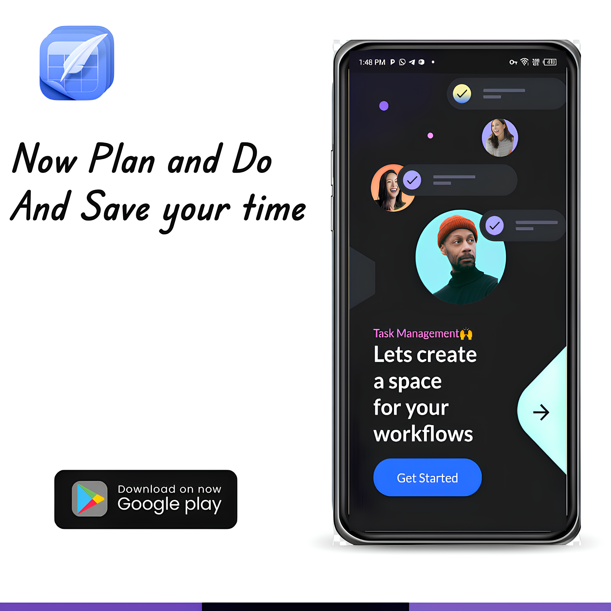
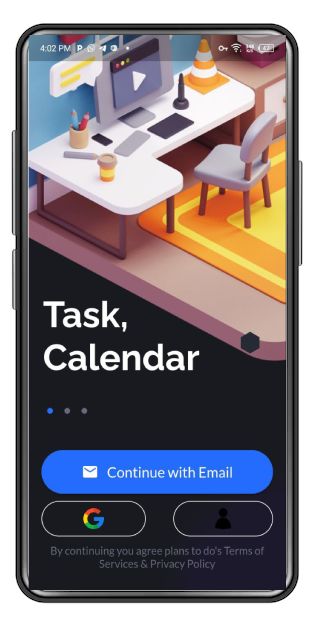
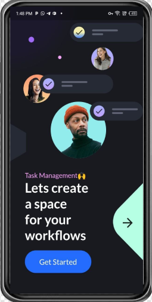
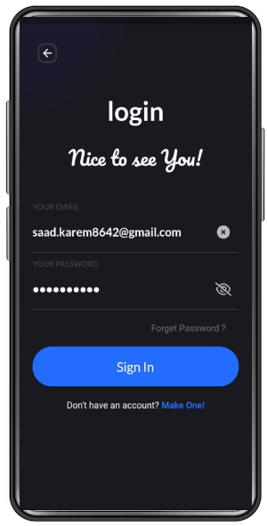
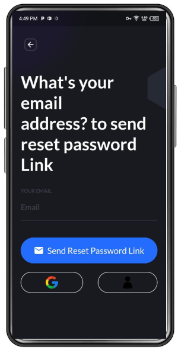
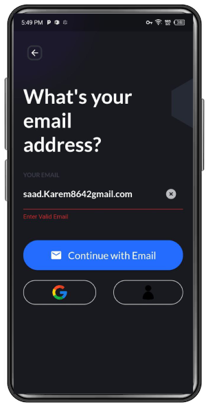

# Edit_PlanToDo-

 
 
🔥 A productivity mobile application UI kit built with Flutter And Full backend made with Firebase and Dart 🔥

 

  Show some :heart: and star the repo to support the project

 

  
Screenshots

  

  
  
  

  <!--  -->
   <!--   -->
  
   
   
   
   

