# Edit_PlanToDo-

 
 
🔥 A productivity mobile application UI kit built with Flutter And Full backend made with Firebase and Dart 🔥

 

  Show some :heart: and star the repo to support the project

 
  

  
  
  

## :sparkles: Features

- ## Multiple Authentication Providers
   - Email Authentication with Email Verification : Users can create accounts or log in using their email addresses,  and  After registering with an email address, users will receive a verification link in their inbox. Clicking on this link verifies that they own the email address and are not using a fake or unauthorized email.
   - Google Authentication : Users can log in using their Google accounts, benefiting from the convenience and security of Google's authentication service.
   - Anonymous Visitor Access: We understand that not everyone wants to create an account right away. Anonymous visitors can use the app with limited functionality as they will not be able to sync their data across multiple devices and later choose to upgrade.
   - Account Linking: Users can link their Google-authenticated and Email-authenticated accounts if they have used the same email address. This allows for seamless transitions and access across devices .
   - Upgrading Anonymous Accounts: Users can upgrade their anonymous visitor accounts to Google or Email-linked accounts while preserving their existing data, and any progress made.

- ## Task Management
  - Users can define personalized workspace categories (e.g., work, sports, or study) tailored to their unique needs and customize them with colors and icons. They can also create and manage tasks within each category, facilitating goal breakdown, and monitor their progress using a progress bar, providing insights into their productivity and accomplishments.
  - After adding categories, users can create tasks with various details, including task name, description, priority, start date, and end date, enabling task management and organization in fast and great way.

## More Coming

 

##  :iphone: Screenshots

  <!--  -->
   <!--   -->
  
   
   
   
   
      
       
        
        
        
        
             
 
                     
                     
                      
                       
                        
                        
                        
                        
                        
                        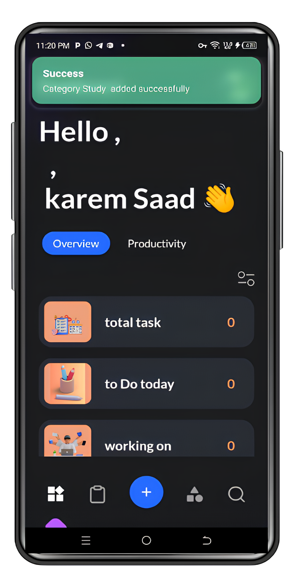
                             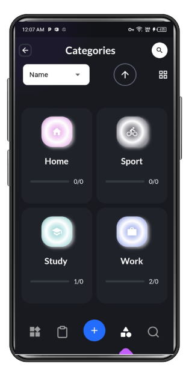
                               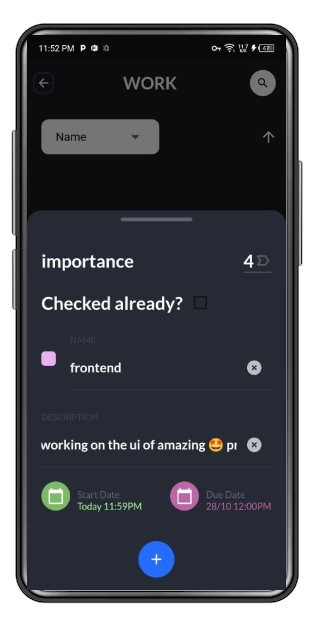  
                               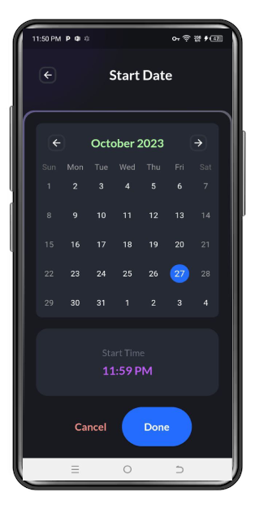
                               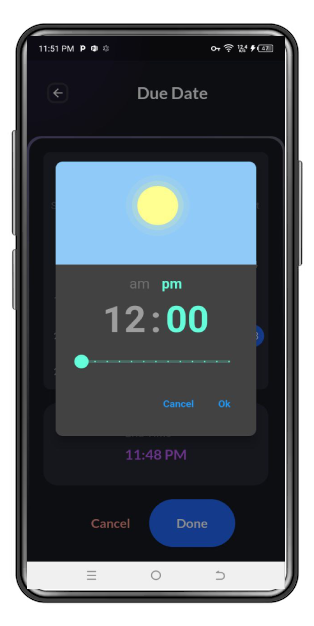  
                               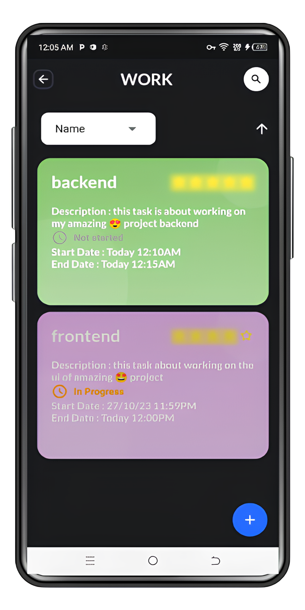
         
         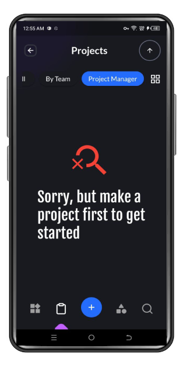
          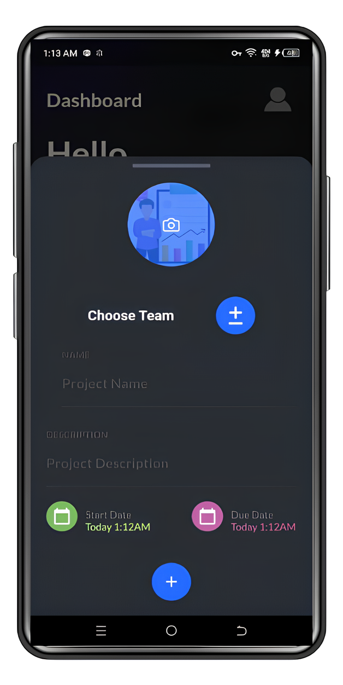
         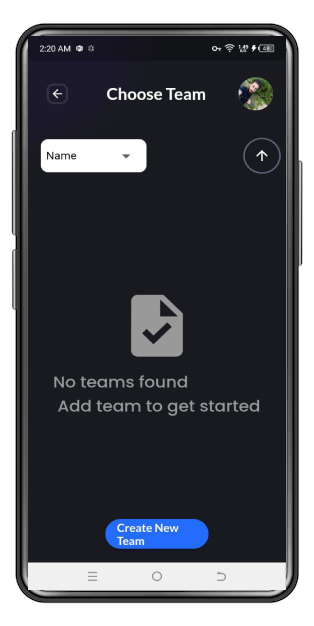
          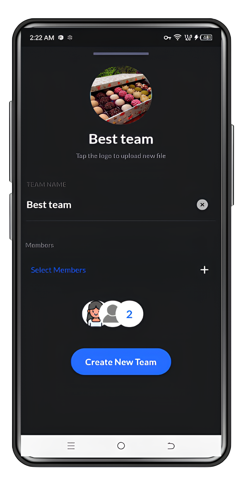
           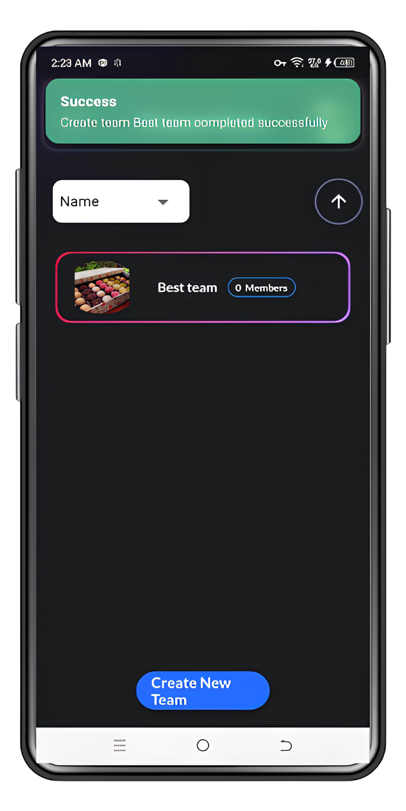
                      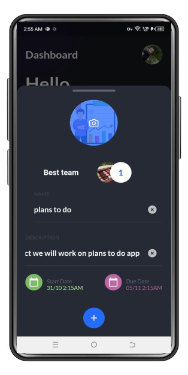
           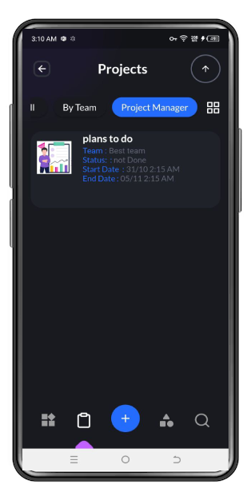
           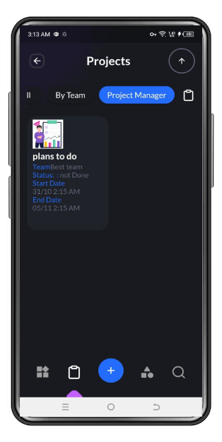
                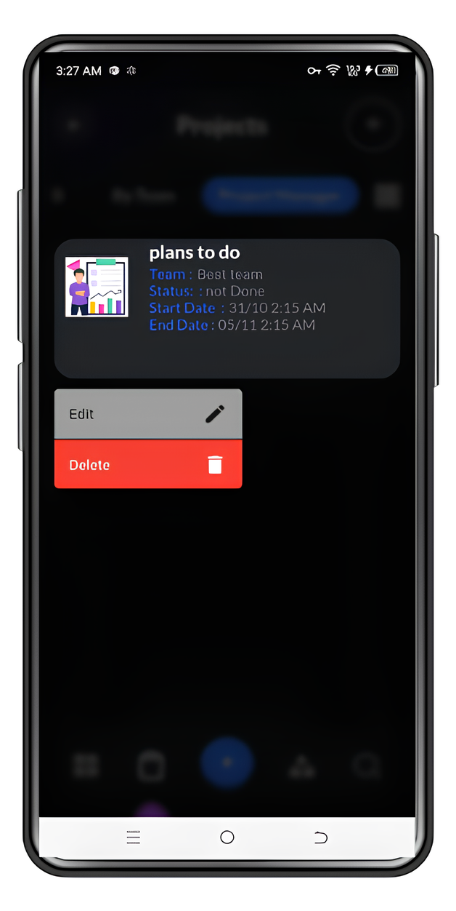     
                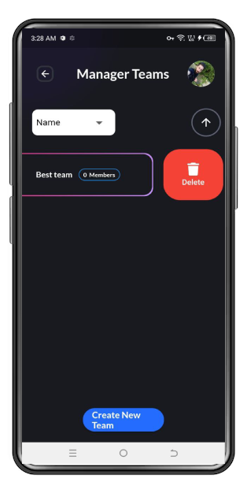    
                 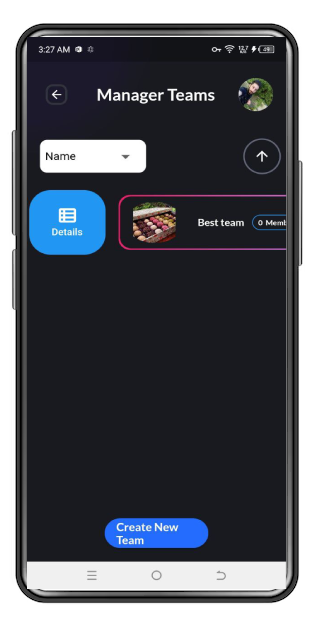
                 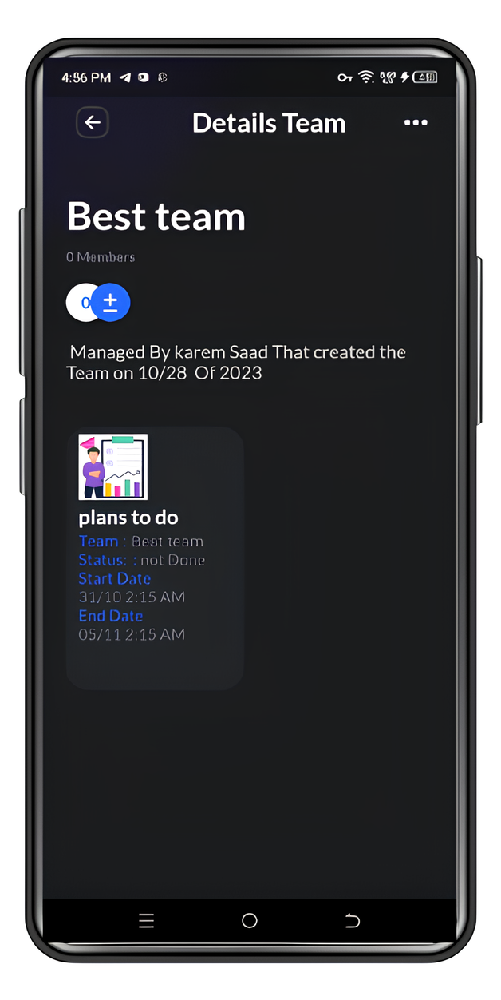
                 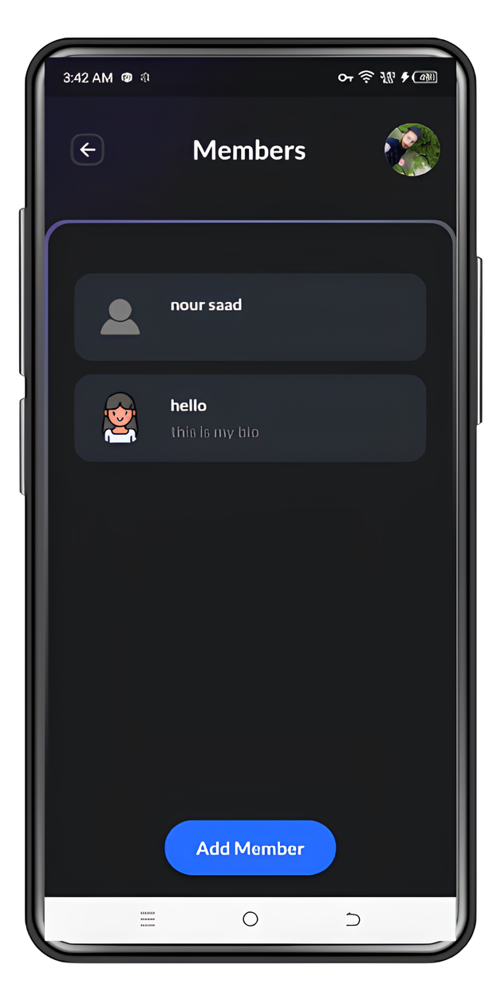
                 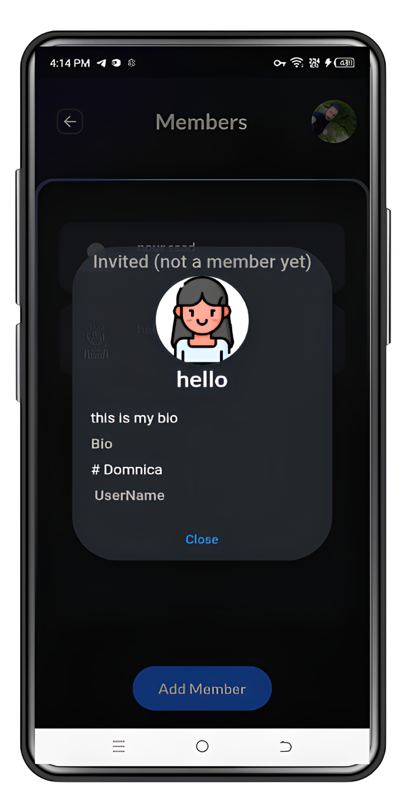
                 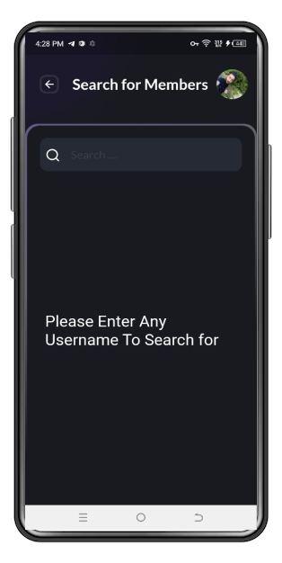
                 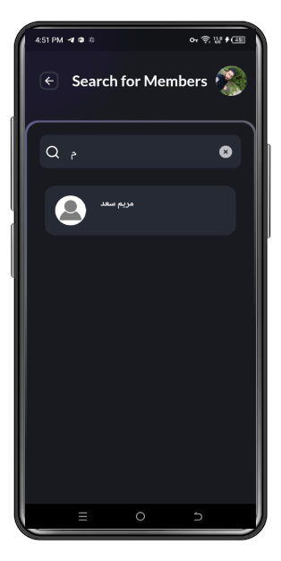
                 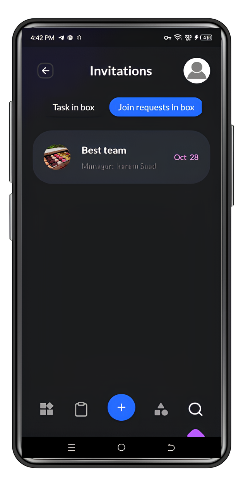
                 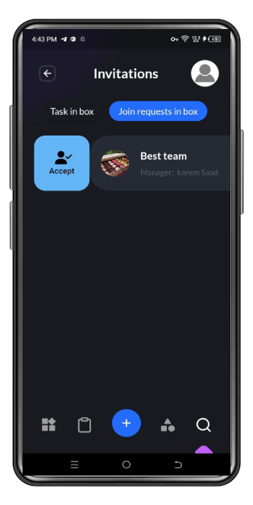
                  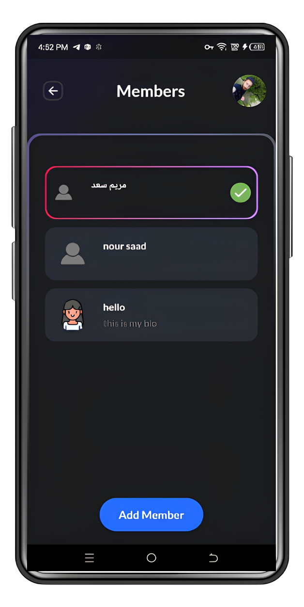

   

